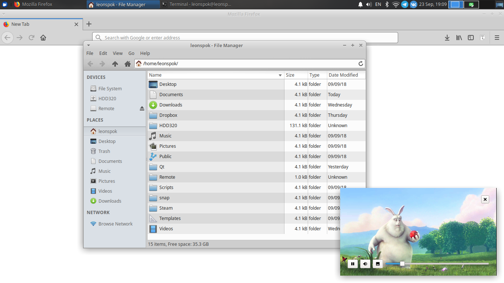
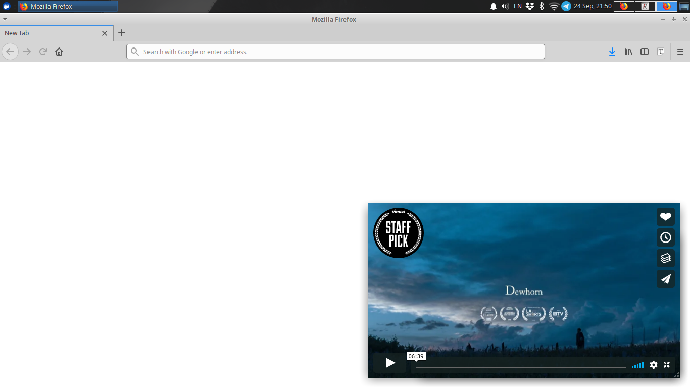

# QtPiP

Picture in Picture player (inspired by macOS).

## Installation

You can try to install **.deb** package from [the latest release](https://github.com/leonspok/QtPiP/releases/latest).

QtPiP was tested only on Xubuntu 18.04 (amd64).

## Usage

    Options:
	   -h,--help		  Show this help message
	   -m,--mode		  Specify mode: mpv/web. Default: mpv.
	   -s,--source 		  Specify url or path to video to play.
	   --stdin		      Read mode and url from stdin.

### MPV mode

In this mode video will be played by [mpv](https://github.com/mpv-player/mpv). This mode is selected by default. YouTube videos are supported if youtube-dl is available. 

### Web mode

Use this mode, if you want to open video from some other web service (for example, Vimeo or Netflix). 

### Stdin input

This option was added to make possible extension for Firefox, which will launch QtPiP via [Native Messaging](https://developer.mozilla.org/en-US/docs/Mozilla/Add-ons/WebExtensions/Native_messaging). If this option is passed, then playing mode and source video should be written to stdin in two lines. Like this:

    $ qtpip --stdin
    web
    https://vimeo.com/channels/staffpicks/289902998

